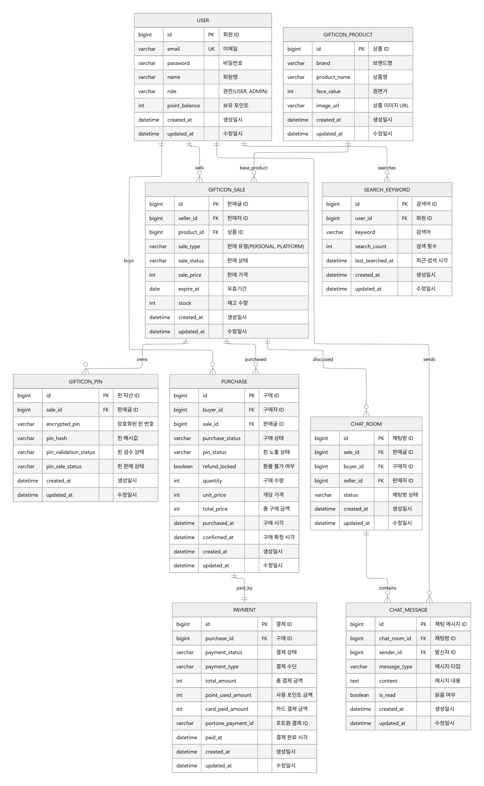
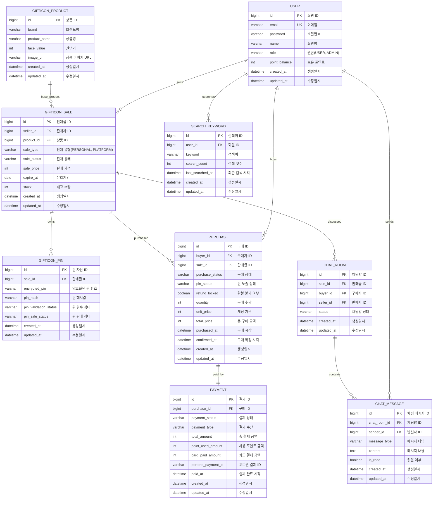

# ERD

## 개요
기프보따리는 회원, 상품, 판매글, 핀 자산, 구매, 결제, 검색어, 채팅 도메인으로 구성됩니다.  
상품 원본 정보와 실제 판매글, 개별 핀 자산을 분리하여 개인 판매와 플랫폼 다건 판매를 모두 지원하도록 설계했습니다.

---

## ERD 다이어그램

```mermaid
erDiagram
    USER {
        bigint id PK "회원 ID"
        varchar email UK "이메일"
        varchar password "비밀번호"
        varchar name "회원명"
        varchar role "권한(USER, ADMIN)"
        int point_balance "보유 포인트"
        datetime created_at "생성일시"
        datetime updated_at "수정일시"
    }

    GIFTICON_PRODUCT {
        bigint id PK "상품 ID"
        varchar brand "브랜드명"
        varchar product_name "상품명"
        int face_value "권면가"
        varchar image_url "상품 이미지 URL"
        datetime created_at "생성일시"
        datetime updated_at "수정일시"
    }

    GIFTICON_SALE {
        bigint id PK "판매글 ID"
        bigint seller_id FK "판매자 ID"
        bigint product_id FK "상품 ID"
        varchar sale_type "판매 유형(PERSONAL, PLATFORM)"
        varchar sale_status "판매 상태"
        int sale_price "판매 가격"
        date expire_at "유효기간"
        int stock "재고 수량"
        datetime created_at "생성일시"
        datetime updated_at "수정일시"
    }

    GIFTICON_PIN {
        bigint id PK "핀 자산 ID"
        bigint sale_id FK "판매글 ID"
        varchar encrypted_pin "암호화된 핀 번호"
        varchar pin_hash "핀 해시값"
        varchar pin_validation_status "핀 검수 상태"
        varchar pin_sale_status "핀 판매 상태"
        datetime created_at "생성일시"
        datetime updated_at "수정일시"
    }

    PURCHASE {
        bigint id PK "구매 ID"
        bigint buyer_id FK "구매자 ID"
        bigint sale_id FK "판매글 ID"
        varchar purchase_status "구매 상태"
        varchar pin_status "핀 노출 상태"
        boolean refund_locked "환불 불가 여부"
        int quantity "구매 수량"
        int unit_price "개당 가격"
        int total_price "총 구매 금액"
        datetime purchased_at "구매 시각"
        datetime confirmed_at "구매 확정 시각"
        datetime created_at "생성일시"
        datetime updated_at "수정일시"
    }

    PAYMENT {
        bigint id PK "결제 ID"
        bigint purchase_id FK "구매 ID"
        varchar payment_status "결제 상태"
        varchar payment_type "결제 수단"
        int total_amount "총 결제 금액"
        int point_used_amount "사용 포인트 금액"
        int card_paid_amount "카드 결제 금액"
        varchar portone_payment_id "포트원 결제 ID"
        datetime paid_at "결제 완료 시각"
        datetime created_at "생성일시"
        datetime updated_at "수정일시"
    }

    SEARCH_KEYWORD {
        bigint id PK "검색어 ID"
        bigint user_id FK "회원 ID"
        varchar keyword "검색어"
        int search_count "검색 횟수"
        datetime last_searched_at "최근 검색 시각"
        datetime created_at "생성일시"
        datetime updated_at "수정일시"
    }

    CHAT_ROOM {
        bigint id PK "채팅방 ID"
        bigint sale_id FK "판매글 ID"
        bigint buyer_id FK "구매자 ID"
        bigint seller_id FK "판매자 ID"
        varchar status "채팅방 상태"
        datetime created_at "생성일시"
        datetime updated_at "수정일시"
    }

    CHAT_MESSAGE {
        bigint id PK "채팅 메시지 ID"
        bigint chat_room_id FK "채팅방 ID"
        bigint sender_id FK "발신자 ID"
        varchar message_type "메시지 타입"
        text content "메시지 내용"
        boolean is_read "읽음 여부"
        datetime created_at "생성일시"
        datetime updated_at "수정일시"
    }

    USER ||--o{ GIFTICON_SALE : sells
    USER ||--o{ PURCHASE : buys
    USER ||--o{ SEARCH_KEYWORD : searches
    USER ||--o{ CHAT_MESSAGE : sends

    GIFTICON_PRODUCT ||--o{ GIFTICON_SALE : base_product
    GIFTICON_SALE ||--o{ GIFTICON_PIN : owns
    GIFTICON_SALE ||--o{ PURCHASE : purchased
    GIFTICON_SALE ||--o{ CHAT_ROOM : discussed

    PURCHASE ||--|| PAYMENT : paid_by
    CHAT_ROOM ||--o{ CHAT_MESSAGE : contains
```